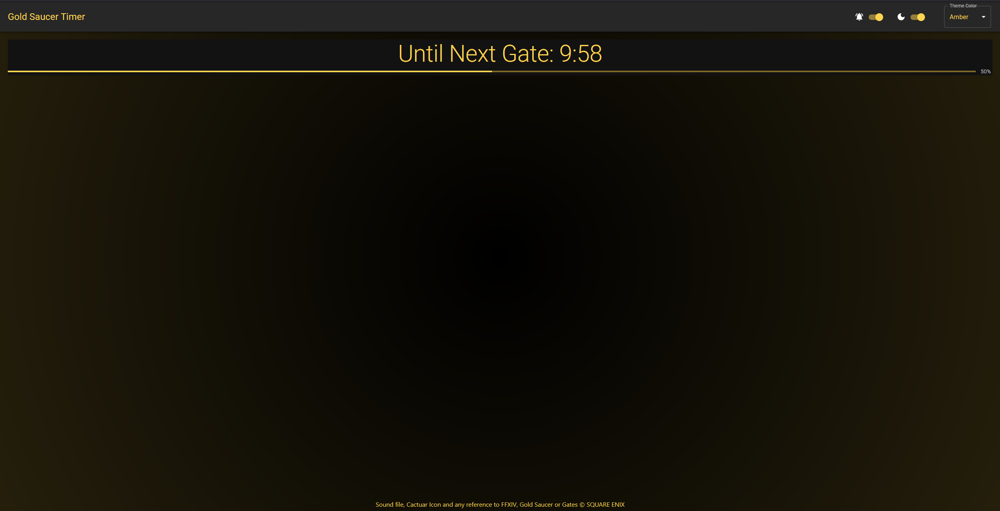

# ffxiv-gate-timer

Gate timer for FFXIV, wanted to learn React and my Bae was manually setting timers.

# Preview:

# How to use it?

[Go Here](https://cyansprite.github.io/ffxiv-gate-timer/)

# TODO:

- [x] Make the theme not.. blue
- [x] Maybe options or decide not to
- [ ] Allow pre-emptive alert (currently it's about 10 seconds before)
- [x] Options for sounds
- [ ] Unit tests (automated?)
- [ ] Make Mobile look nice

# SquareEnix Copyright

`src/sound/fate_start.mp3` and any mention of gates, FFXIV, whatever, is © SQUARE ENIX
